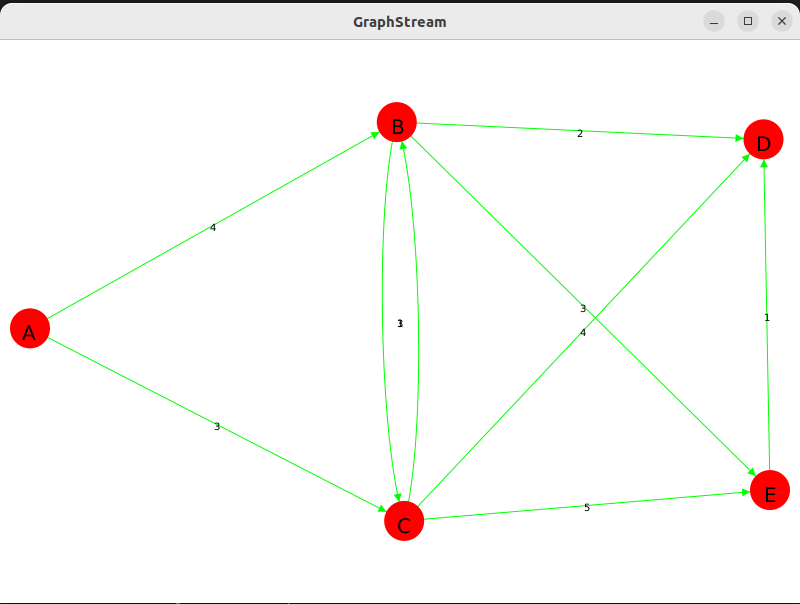

<div style="display: flex; align-items: center; justify-content: space-between; margin-bottom: 2rem;">
    
    <div style="text-align: right; font-weight: bold; ">
        Auteur : THIAM Papa
    </div>
</div>
<div style="text-align: center; font-size: 1.5rem; margin-bottom: 1.5rem;">
    M1 - Informatique  Université Le Havre
</div>

---

# TP3 - Plus courts chemins

## **Description**

Le TP **PlusCourtsChemins** a pour objectif de mettre en œuvre différents algorithmes permettant de calculer les plus courts chemins dans des graphes. Il inclut la mise en place d'un générateur de graphes aléatoires, ainsi qu'une implémentation de l'algorithme de Dijkstra pour trouver les plus courts chemins entre les nœuds d'un graphe pondéré.

Ce projet est basé sur l'utilisation de **GraphStream**, une bibliothèque Java permettant de manipuler et de visualiser des graphes dynamiques.

## **Fonctionnalités**

- Générateur de graphes aléatoires avec des poids sur les arêtes.
- Implémentation de l'algorithme de Dijkstra pour le calcul des plus courts chemins.
- Visualisation interactive des graphes générés et des résultats des algorithmes avec **GraphStream**.
- Tests pour valider les résultats des algorithmes.
### Dépendances

- **GraphStream** : Bibliothèque pour la manipulation et la visualisation des graphes.
- **Maven** : Outil de gestion des dépendances et de compilation.

## **Utilisation**

### Génération d'un graphe aléatoire :
Le générateur de graphes aléatoires pour visualiser un graphe avec des poids aléatoires sur les arêtes. Voici un exemple de génération d'un graphe avec 100 nœuds :

```java

        Graph graph = new SingleGraph("Graphe aléatoire");
        Generator generator = new RandomGenerator(3); // degré moyen 3
        generator.addSink(graph);
        graph.setAttribute("ui.stylesheet", "node { size: 15px; fill-color: red; } edge { fill-color: green; }");
        graph.setAttribute("ui.quality");
        graph.setAttribute("ui.antialias");

    
        Random rand = new Random();
        generator.begin();

        // Générer 100 événements 
        for (int i = 0; i < 100; i++) {
            generator.nextEvents();
        }
        
        // Ajouter un poids aléatoire à chaque arête
        for (Edge edge : graph.nodes().flatMap(node -> node.edges()).toArray(Edge[]::new)) {
            edge.setAttribute("weight", rand.nextInt(10));
        }
        
        generator.end();

        graph.display();


```

### Implémentation de Dijkstra :
> La Classe `myDijkstra` implémente l'interface Algorithm et fournit une implémentation de l'algorithme de Dijkstra.

> Les classes Node et Edge sont utilisées pour représenter les nœuds et les arêtes du graphe, respectivement.
    
les etapecles de l'algorithme sont les suivantes:
    
    1. Initialiser les distances entre le nœud source et les autres nœuds à l'infini, sauf pour le nœud source lui-même, dont la distance est de 0.
    
    2. Ajouter le nœud source à la file de priorité.
    
    3. Tant que la file de priorité n'est pas vide, extraire le nœud u avec la distance minimale.
 
    4. Parcourir les arêtes sortantes du nœud u et mettre à jour les distances des nœuds voisins si une distance plus courte est trouvée.
    
    5. Répéter les étapes 3 et 4 jusqu'à ce que la file de priorité soit vide.
 
    6. Retourner les distances et les prédécesseurs calculés.


```java
public class myDijkstra implements Algorithm {
    private Map<Node, Integer> distances; // Distance entre le nœud source et le nœud courant
    private Map<Node, Node> predecessors; // Prédécesseur du nœud courant
    private PriorityQueue<Node> pq; // File de priorité pour les nœuds à traiter

    public myDijkstra() {
        this.distances = new HashMap<>();
        this.predecessors = new HashMap<>();
        this.pq = new PriorityQueue<>(Comparator.comparingInt(distances::get));
    }

    @Override
    public void computeShortestPaths(Node source) {
        distances.put(source, 0);
        pq.add(source);
        // Tant que la file de priorité n'est pas vide
        while (!pq.isEmpty()) {
            Node u = pq.poll();

            // Parcourir les arêtes sortantes du nœud u
            for (Edge e : u.getOutgoingEdges()) {
                Node v = e.getDestination();
                int weight = e.getWeight();
                int distanceThroughU = distances.get(u) + weight; // Distance entre le nœud source et le nœud v en passant par u

                // Si la distance entre le nœud source et le nœud v en passant par u est inférieure à la distance actuelle
                if (distanceThroughU < distances.getOrDefault(v, Integer.MAX_VALUE)) {
                    pq.remove(v);
                    distances.put(v, distanceThroughU);
                    predecessors.put(v, u);
                    pq.add(v);
                }
            }
        }
    }

    @Override
    public Map<Node, Integer> getDistances() {
        return distances;
    }

    @Override
    public Map<Node, Node> getPredecessors() {
        return predecessors;
    }
}

```

- Exemple du cour :



### Dijkstra par GraphStream


```java

    // Initialisation de Dijkstra avec GraphStream
    Dijkstra dijkstra = new Dijkstra(Element.EDGE, null, "ui.label"); // Utilisation des poids des arêtes
    dijkstra.init(graph);
    dijkstra.setSource(graph.getNode("A")); //  A comme source
    dijkstra.compute(); 

    // Affichage des plus courts chemins
    for (org.graphstream.graph.Node node : graph) {
        System.out.println("Chemin le plus court vers " + node.getId() + ": " + 
                           dijkstra.getPath(node)); // Affiche le chemin complet
        System.out.println("Distance: " + dijkstra.getPathLength(node)); // Affiche la distance totale
    }
    // Libérer les ressources
    dijkstra.clear();
```

> On a utilisé la classe Dijkstra de GraphStream pour calculer les plus courts chemins. Avec cette classe, on peut définir la source (setSource), calculer les plus courts chemins (compute), obtenir le chemin complet (getPath) et la distance totale (getPathLength).

###### - Sorie : #####

```sh
############################## Plus courts chemins ##############################
---------------------------------------- Mon Dijkstra ----------------------------------------
Temps d'exécution du Dijkstra personnalisé: 4.1399E-5 secondes
Chemin le plus court vers C: 3
Distance: 3
Chemin le plus court vers E: 7
Distance: 7
Chemin le plus court vers D: 6
Distance: 6
Chemin le plus court vers B: 4
Distance: 4
Chemin le plus court vers A: 0
Distance: 0
---------------------------------------- Dijkstra de GraphStream ----------------------------------------
Temps d'exécution du Dijkstra de GraphStream: 0.0017767420000000002 secondes
Chemin le plus court vers A: [A]
Distance: 0.0
Chemin le plus court vers B: [A, B]
Distance: 4.0
Chemin le plus court vers C: [A, C]
Distance: 3.0
Chemin le plus court vers D: [A, B, D]
Distance: 6.0
Chemin le plus court vers E: [A, B, E]
Distance: 7.0
```
### Comparaison
---
>  Le temps d'exécution du Dijkstra personnalisé est plus rapide que celui de GraphStream pour le même graphe.


## **Badges**


## **Installation**

### Prérequis

- Java 8 ou supérieur
- Maven (pour la gestion des dépendances)

### Étapes d'installation

1. Clonez ce dépôt :

    ```bash
    git clone https://www-apps.univ-lehavre.fr/forge/tp240053/pluscourtschemins.git
    cd pluscourtschemins
    ```

2. Utilisez Maven pour télécharger et installer les dépendances nécessaires :

    ```bash
    mvn install
    ```

3. Vous pouvez maintenant exécuter le projet en lançant la classe principale `RandomGraphExample` qui génère un graphe aléatoire, ou toute autre classe contenant un algorithme à tester.

---
## 

**Auteur : THIAM PAPA**  
**Profs :** Éric Sanlaville, Stefan Balev, Antoine Toullalan

## Project status
Le développement du projet est en cours.
